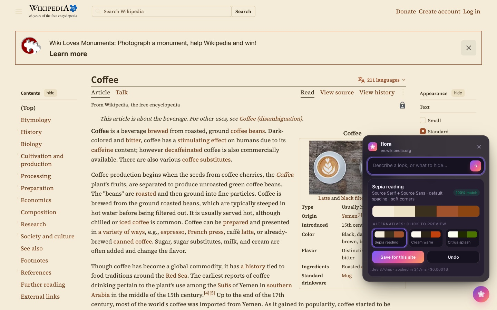
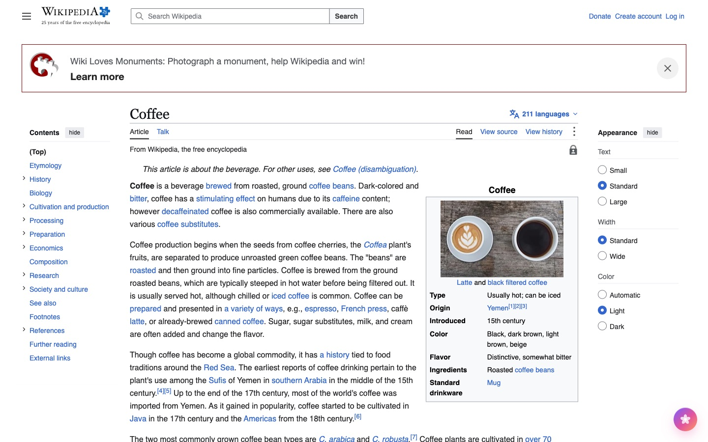
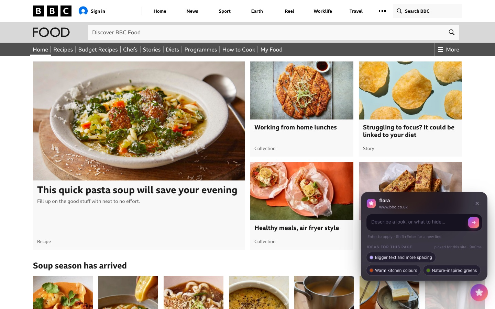
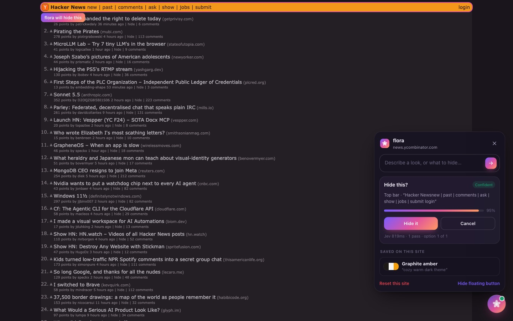
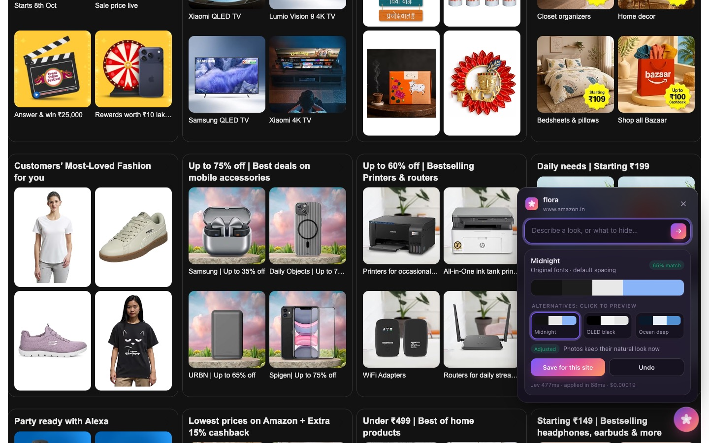
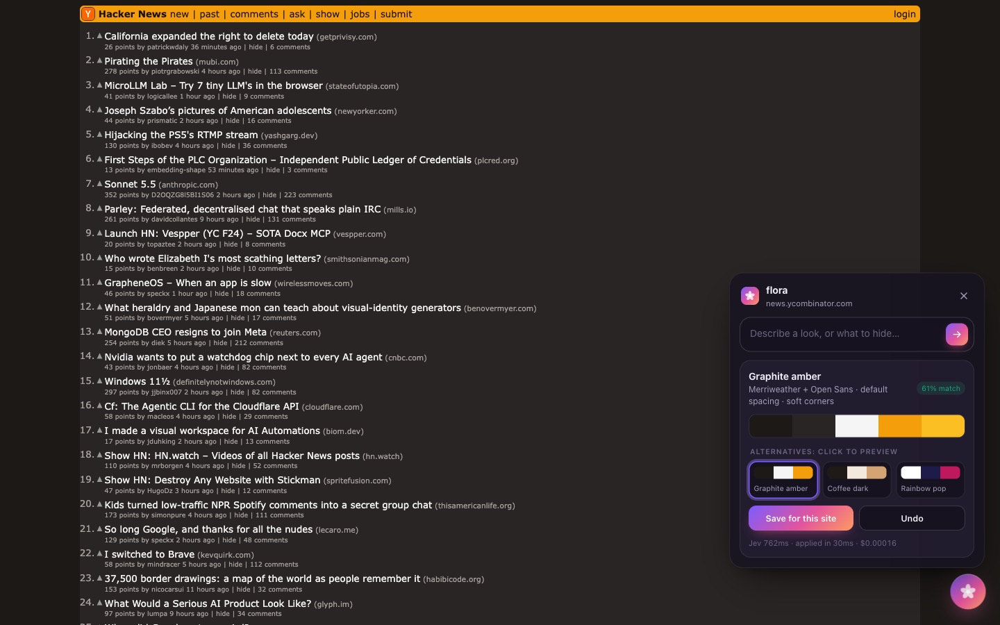
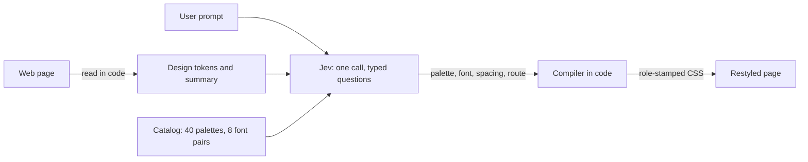

<h1 align="center">flora 🌸</h1>

<p align="center">Restyle any website just by describing it. Dark mode where there is none, a calm reading mode, a cyberpunk theme, or "hide that cookie banner", all in plain English.</p>

<div align="center">


-7b5cff?style=for-the-badge)


</div>

<p align="center">
  
</p>

<p align="center"><i>"warm sepia reading mode" on Wikipedia: picked in 376 ms, applied in a few hundred ms, for $0.00016.</i></p>

## 🎥 DEMO

| Before | After: *"warm sepia reading mode"* |
|---|---|
|  |  |

| Ideas picked for each site | Hide anything, with a preview |
|---|---|
|  |  |
| **Follow-ups that fix things**: *"images are also getting dark"* | **Any look, any site**: *"cozy warm dark theme"* |
|  |  |

## 📙 Features

flora is a browser extension with a small floating widget on every page. Type what you want, and the page changes.

- **Describe a look**: "dark mode", "calm and easy to read", "old newspaper look". flora picks a palette, fonts, spacing and corner style that fit, and applies them straight away.
- **Instant alternatives**: every result comes with the next two best palettes. Click to preview them, with no extra wait.
- **Hide anything**: "hide the sidebar", "hide the cookie banner", "remove the ads". flora highlights what it found and asks before hiding it.
- **Ideas for this page**: suggestions change from site to site. A recipe site gets *warm kitchen colours*, a sports site *sporty bold dark*, a newspaper *old newspaper look*. It only suggests hiding things that are actually on the page.
- **Understands follow-ups**: "a bit warmer", "bigger text", "images are also getting dark" or "undo that" adjust what's on screen instead of starting over.
- **Saved per site**: saved looks and hides re-apply on every visit, instantly and with **no network call at all**.
- **Hard to break**:
  - Every palette is contrast-checked.
  - Text over photos and video keeps its colour.
  - Modal backdrops stay translucent.
  - Product photos never turn black.
  - Site CSS can't break the widget, and the widget stays above site pop-ups.
- **Private by design**:
  - Your API key lives in a local server, never in the extension.
  - Only a short, redacted summary of the page is sent, never the full page.

## 🧠 How it works: *Jev chooses, code builds*

Most "AI restyle" extensions ask an LLM to write CSS. That's slow (seconds), costly, and the CSS breaks in creative ways. flora takes the opposite approach.

It uses **[Jev](https://docs.typesafe.ai)**, TypeSafe AI's *System One* model. Jev doesn't generate text: it answers typed questions (pick one of these, rate this, yes or no) with calibrated probabilities, in a few hundred milliseconds. So flora never asks it to write anything. It asks it to **choose**, and deterministic code builds the result.



1. **Read the page (code).** flora collects the site's real colours, clusters them into roles (background, surface, text, muted, accent, border), and writes an English summary. Jev reads words far better than hex codes.
2. **Ask once (Jev).** One request asks everything at once: which palette, which font pair, how much spacing, which corner style, reading mode or not, and **what kind of request this is** (new look, adjust the current look, fix images, a page element, undo). The answers come back as typed options from the catalog, so nothing can be invalid.
3. **Build the CSS (code).** Each element is tagged with the palette role its original colour maps to, and one stylesheet applies the picks. Nothing is regenerated on the next visit: the saved picks are simply compiled again.

Picking an element works the same way. Code lists the page's landmarks and blocks in plain English, and Jev picks the one you mean. Very large pages use TypeSafe's *speculative fan-out*: several full-detail questions in parallel, then one final choice.

### By the numbers

Measured on 20 real websites (Wikipedia, GitHub, BBC, Guardian, YouTube, Amazon, Booking and others), calling Jev from India:

| | |
|---|---|
| Restyle decision | **~414 ms** typical (p50), 654 ms p95 |
| Cost per restyle | **~$0.00016** (one call, 7 questions) |
| Right kind of look for the request | **120 / 120** prompts |
| Same answer when repeated | **98%** |
| Text failing contrast after restyle | **0%** |
| Element picking (first guess / top 3) | **96% / 100%** |
| Follow-up routing (new / refine / images / element / undo) | **13 / 13** |

## 🚀 Quick Start

**You need:** Node 22+, [pnpm](https://pnpm.io), a Chromium browser (Chrome, Brave, Edge or Arc), and a [TypeSafe API key](https://console.typesafe.ai/settings/keys).

1. Clone and install.

```bash
git clone https://github.com/apneduniya/flora.git
cd flora
pnpm install
cp .env.example .env   # then set TYPESAFE_API_KEY=...
```

2. Start the local server that holds your key, and keep it running.

```bash
pnpm --filter @flora/server dev   # http://localhost:8787
```

3. Build the extension.

```bash
pnpm --filter @flora/extension build
```

4. Load it:
   1. Open `chrome://extensions` (or `brave://extensions`).
   2. Turn on **Developer mode**.
   3. Click **Load unpacked** and select **`extension/build/chrome-mv3`**.

5. Open any website and click the 🌸 button in the bottom-right corner, or press **Alt+Shift+F**.

> 💡 Prefer one command? `pnpm dev:ext` starts the server and opens a browser with flora already loaded, with hot reload.

**Things to try:** `dark mode` · `calm and easy to read` · `high contrast for low vision` · `cyberpunk neon look` · `hide the cookie banner` · `hide the sidebar`, then follow up with `a bit warmer` or `undo that`.

## 🧪 Test harness

`harness/` is a Playwright CLI that measures flora on real sites. It snapshots each page once and replays it, so results are repeatable and Jev calls are cached.

```bash
pnpm test                          # catalog contrast rules + compiler tests
pnpm harness smoke                 # one live Jev call
pnpm harness snapshot && pnpm harness extract
pnpm harness restyle --repeats 3   # 20 sites x 6 prompts, renders + breakage checks
pnpm harness label                 # confirm ground-truth labels for element picking
pnpm harness pick                  # element-picking accuracy
pnpm harness suggest               # site-aware ideas for every site
pnpm harness report                # local HTML report (not committed)
pnpm harness preview --sites hn --palette midnight   # check the compiler without Jev
```

## 🗂 Project layout

| Path | What's inside |
|---|---|
| `packages/core` | Everything shared: token extraction, catalog, Jev client and question builders, CSS compiler, element picking, suggestions |
| `extension` | The WXT (Manifest V3) extension: in-page widget in a closed Shadow DOM, content script, service worker |
| `server` | Tiny Hono proxy on `localhost:8787` that keeps your TypeSafe key out of the extension |
| `harness` | Playwright CLI for measuring quality, speed and cost on real websites |

## 🛣 Roadmap

- 🌍 **Community themes**: share a saved look in one click. A theme is just a few picks, so it's tiny and applies with no model call.
- 🎨 More catalog palettes, especially bold, colourful-background "playful" looks
- 🖼 Tinting SVG logos and icons in dark themes
- 🦊 Firefox and Safari support
- ☁️ An optional hosted proxy, so no local server is needed

## 🤗 Contributing
1. Fork the repository.
2. Create a new branch: `git checkout -b feature-name`.
3. Make your changes (and run `pnpm test`).
4. Push your branch: `git push origin feature-name`.
5. Create a pull request.

## 🙏 Acknowledgements

- [TypeSafe AI](https://typesafe.ai) for Jev and the System One docs and cookbooks.
- Ideas borrowed from open-source Jev projects:
  - [browser-use/jev-ultrafast](https://github.com/browser-use/jev-ultrafast)
  - [jev-browser](https://github.com/Ying-Kai-Liao/jev-browser)
  - [AnyFilter](https://github.com/anyfilter/anyfilter)
  - [typesafe-adblock](https://github.com/realZachi/typesafe-adblock)
  - [unclutter](https://github.com/kitze/unclutter)
  - [slop-filter](https://github.com/adamnroman/slop-filter)
  - [json-render](https://github.com/vercel-labs/json-render)
